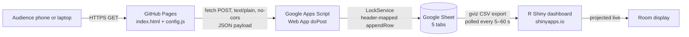

# Beyond AI: From Ideas to Impact

**An interactive, audience-participatory web presentation on Level 3 AI integration in curriculum, with live response capture and a real-time analytics dashboard.**

Learning Retreat 2026 · School Sharing Session · Republic Polytechnic

| | |
|---|---|
| **Author** | Aaron Chen Angus, Lead Specialist (Artificial Intelligence), School of Sports and Health (SSH), Republic Polytechnic |
| **Contact** | aaron_chen_angus@rp.edu.sg |
| **Session length** | 20 minutes |
| **Module showcased** | S3729C: AI-Assisted App Development & Data Analytics |
| **Status** | Deployed; voting pipeline verified end to end |

---

## Contents

1. [Live resources](#1-live-resources)
2. [Purpose and scope](#2-purpose-and-scope)
3. [Pedagogical and scientific rationale](#3-pedagogical-and-scientific-rationale)
4. [Session design and running order](#4-session-design-and-running-order)
5. [The four student applications](#5-the-four-student-applications)
6. [Audience-response instruments and answer keys](#6-audience-response-instruments-and-answer-keys)
7. [System architecture](#7-system-architecture)
8. [Repository structure](#8-repository-structure)
9. [Front-end: the deck](#9-front-end-the-deck)
10. [Back-end: Google Apps Script and Google Sheets](#10-back-end-google-apps-script-and-google-sheets)
11. [Data dictionary](#11-data-dictionary)
12. [Live analytics dashboard (R Shiny)](#12-live-analytics-dashboard-r-shiny)
13. [Statistical methods](#13-statistical-methods)
14. [Setup and deployment](#14-setup-and-deployment)
15. [Operating procedure on the day](#15-operating-procedure-on-the-day)
16. [Privacy, ethics and data governance](#16-privacy-ethics-and-data-governance)
17. [Limitations](#17-limitations)
18. [Troubleshooting](#18-troubleshooting)
19. [Customisation guide](#19-customisation-guide)
20. [Acknowledgements and licence](#20-acknowledgements-and-licence)
21. [References](#21-references)

---

## 1. Live resources

| Resource | URL |
|---|---|
| **Web app (deck)** | https://aaron-chen-angus.github.io/learningretreat2026/ |
| **Repository** | https://github.com/aaron-chen-angus/learningretreat2026 |
| **Live results (Google Sheet)** | https://docs.google.com/spreadsheets/d/1PU45VVHvAU_0ka7CHSVRunT0t1itAuIkz477-yeda4I/edit?usp=sharing |
| **R Shiny live dashboard** | *To be added after deployment to shinyapps.io* |

### Student applications showcased (S3729C)

| App | Web app | R Shiny dashboard | Repository | Results sheet |
|---|---|---|---|---|
| BalanceVision | [App](https://aaron-chen-angus.github.io/BalanceVision/) | [Dashboard](https://intellicare.shinyapps.io/BalanceVision/) | [Repo](https://github.com/aaron-chen-angus/BalanceVision) | [Sheet](https://docs.google.com/spreadsheets/d/1Ly_4NAyrZkuKwGuYUwez3qEGAnNIMqvMMrOOABXbgLE/) |
| Silver HYROX | [App](https://aaron-chen-angus.github.io/SilverHYROX/) | [Dashboard](https://intellicare.shinyapps.io/SilverHyroxDashboard/) | [Repo](https://github.com/aaron-chen-angus/SilverHYROX) | [Sheet](https://docs.google.com/spreadsheets/d/1P-09DEozBacsb7OGXcxDaReKPsnWeIlWjnaUUzjlMvE/) |
| Cognitive Challenge | [App](https://aaron-chen-angus.github.io/CognitiveChallenge/) | [Dashboard](https://intellicare.shinyapps.io/CognitiveChallenge/) | [Repo](https://github.com/aaron-chen-angus/CognitiveChallenge) | [Sheet](https://docs.google.com/spreadsheets/d/153FqhzifEQqk-jJsS67DKIy7HeK9fHBn8AYU5GcS0DA) |
| Milo's Big School Adventure | [App](https://aaron-chen-angus.github.io/MiloAdventure/) | [Dashboard](https://intellicare.shinyapps.io/MiloDashboard/) | [Repo](https://github.com/aaron-chen-angus/MiloAdventure) | [Sheet](https://docs.google.com/spreadsheets/d/1OiaM2AoJ_D3h9-YtQuBZ3o1aoTeinktMPZ1_E3umYh4) |

### Scaling the model: SMILE and related builds

| Project | Web app | R Shiny dashboard | Repository |
|---|---|---|---|
| SMILE (Smart Monitoring) portal | https://smile.hpilab.net/ | – | – |
| SMILE: Facial Asymmetry Screen | [App](https://aaron-chen-angus.github.io/smile-fa/) | [Dashboard](https://smile-rp.shinyapps.io/SMILE-FA/) | [Repo](https://github.com/aaron-chen-angus/smile-fa) |
| SMILE: Speech Signal Lab | [App](https://aaron-chen-angus.github.io/speechsignal/) | [Dashboard](https://smile-rp.shinyapps.io/SMILE-SpeechSignal/) | [Repo](https://github.com/aaron-chen-angus/speechsignal) |
| SMILE: PLR Screener (pupillary light reflex) | [App](https://aaron-chen-angus.github.io/pupil-plr-screener/) | [Dashboard](https://smile-rp.shinyapps.io/SMILE_PLRscreener/) | [Repo](https://github.com/aaron-chen-angus/pupil-plr-screener) |
| SMILE: Pronator Drift | [App](https://aaron-chen-angus.github.io/pronator-drift-app/) | [Dashboard](https://smile-rp.shinyapps.io/SMILE-PronatorDrift/) | [Repo](https://github.com/aaron-chen-angus/pronator-drift-app) |
| Virtual BlazePod | [App](https://aaron-chen-angus.github.io/blazepod-reaction-game/) | [Dashboard](https://smile-rp.shinyapps.io/Virtual_BlazePod/) | – |
| Lingua//Grid | [App](https://aaron-chen-angus.github.io/lingua-grid/) | – | – |

---

## 2. Purpose and scope

This repository hosts a mobile-first, browser-based presentation delivered at the Republic Polytechnic Learning Retreat 2026 School Sharing Session. It has three aims:

1. **Explain Level 3 AI integration** in the institutional AI Proficiency Levels framework, where learners move from *using* AI tools to *developing* AI tools and applications ethically and responsibly within their discipline.
2. **Demonstrate the model in practice** through S3729C, where Sports and Health students identify real gaps in their workplaces or volunteer settings, co-develop a web application with an AI coding assistant (Kiro), collect real-world data, and analyse it in an R Shiny dashboard.
3. **Model the pedagogy it describes.** The audience does not only watch: they try each student app on their phones, vote on the gap each app was built to close, and practise distinguishing metacognitive from directive AI prompts. Their votes stream into a Google Sheet and a live dashboard, which is the same collect, store, visualise pipeline used by the students.

The artefact is designed to be reusable by colleagues in other schools (Hospitality, Applied Science, Technology for the Arts, Media and Design, and Business) as a template for embedding Level 3 AI integration in their own modules.

---

## 3. Pedagogical and scientific rationale

### 3.1 AI Proficiency Levels and the hallmark of Level 3

The session is anchored on the institution's four-level AI Proficiency framework:

| Level | Name | Descriptor | Verb |
|---|---|---|---|
| L1 | Awareness | Develop foundational understanding of AI and related issues within disciplines or technical domains | Aware |
| L2 | Application | Use AI ethically and responsibly within disciplines or technical domains | Use |
| **L3** | **Development** | **Develop AI tools or applications ethically and responsibly within disciplines or technical domains** | **Build** |
| L4 | Design | Design AI systems ethically and responsibly within disciplines or technical domains | Design |

Level 3 carries three expectations, each mapped to concrete activities in S3729C:

| L3 expectation | Where it is enacted in S3729C |
|---|---|
| Customise or build AI tools for real-world use, with reference to industry trends and practices | Groups formed around workplace commonalities identify a real programme gap, write requirements, then co-develop and deploy a working web app with Kiro |
| Account for usability, bias etc. | Peer testing, iterative refinement, and real-world data collection with classmates, family and friends; interrogation of data quality in R Shiny |
| Embed ethics early in the developmental process | Privacy and honest-claims requirements written at the specification stage: pseudonymous identifiers, on-device video processing, "screening not diagnosis" framing, and strengths-based rather than deficit language |

**The hallmark of Level 3** is the shift of the learner's role from *user of AI* to *builder of AI-enabled tools*, with usability, bias and ethics designed in from the start rather than audited at the end. Level 4, by contrast, involves system-level architecture and governance and is typically demonstrated in capstone projects.

This aligns with conceptualisations of AI literacy that progress from knowing and understanding AI, to using and applying it, to evaluating and creating with it, with ethics running across all levels (Long & Magerko, 2020; Ng et al., 2021).

### 3.2 Why metacognition is the core design principle

Metacognition is knowledge about, and regulation of, one's own cognition (Flavell, 1979). It is commonly separated into *knowledge of cognition* and *regulation of cognition*, with regulation comprising planning, monitoring and evaluation (Schraw & Dennison, 1994). Self-regulated learning models describe the same processes as a cycle of forethought, performance and self-reflection (Zimmerman, 2002). Metacognitive skill is most effectively developed when instruction is embedded in subject content, learners are told why the strategies are useful, and practice is sustained over time (Veenman et al., 2006).

Generative AI creates a specific risk to these processes. In a field experiment with nearly a thousand secondary mathematics students, unrestricted access to a GPT-4 interface improved performance while access was available, but students performed 17% worse than controls once access was removed. A version with pedagogical safeguards largely removed this harm (Bastani et al., 2025). In a randomised laboratory study of essay revision, learners supported by ChatGPT improved their task output but showed fewer metacognitive processes such as evaluation and orientation, a pattern the authors termed *metacognitive laziness* (Fan et al., 2025). Generative AI also places new metacognitive demands on users: formulating a prompt requires clarity about goals and task decomposition, and judging an output requires well-calibrated confidence (Tankelevitch et al., 2024). More broadly, reviews of large language models in education stress that benefits depend on learners retaining critical judgement over AI output (Kasneci et al., 2023).

S3729C therefore treats metacognitive prompting as a guardrail. Students are taught to plan (define users and success), evaluate (identify weaknesses with evidence), justify (explain why each change matters) and refine (implement only what adds value) *before* accepting AI-generated code or designs. The "Spot the metacognitive prompt" activity in this deck lets colleagues practise that same discrimination.

### 3.3 Guided co-development, not unguided discovery

Novices learn less from minimally guided discovery than from guided instruction (Kirschner et al., 2006). S3729C is deliberately structured so that problem discovery and requirements specification happen *before* AI is introduced, and the first build is co-developed with the lecturer. This preserves student ownership of the thinking while providing the scaffolding novices need.

### 3.4 Authentic, project-based and design-oriented learning

The module follows a design-thinking arc of empathising with users, defining the problem, ideating, prototyping and testing (Razzouk & Shute, 2012), within a project-based structure whose benefits depend on scaffolding and authentic tasks (Kokotsaki et al., 2016). Iterative peer and user testing supplies feedback aimed at the task, the process and self-regulation, the levels at which feedback is most effective (Hattie & Timperley, 2007).

### 3.5 Active learning and audience response in the session itself

Active learning reliably outperforms traditional lecturing on examination performance and reduces failure rates (Freeman et al., 2014). Audience response systems increase engagement and attention, particularly when questions are conceptual and followed by discussion (Caldwell, 2007; Kay & LeSage, 2009), a principle formalised in Peer Instruction (Crouch & Mazur, 2001). Each voting item in this deck is a two-option conceptual question, answered individually on a phone before the presenter reveals the answer, which creates a natural discussion point.

### 3.6 Ethics and responsible AI

Systematic reviews of AI in higher education have noted limited critical reflection on pedagogical and ethical implications (Zawacki-Richter et al., 2019). Frameworks for AI ethics in education call for attention to fairness, transparency, privacy and learner agency across the whole lifecycle (Holmes et al., 2022), and institutional policy frameworks address pedagogical, governance and operational dimensions together (Chan, 2023). The student apps embed these principles at specification stage, and the voting instrument itself collects no personal identifiers (see [Section 16](#16-privacy-ethics-and-data-governance)).

### 3.7 Transfer to other schools

The Technological Pedagogical Content Knowledge (TPACK) framework holds that effective technology integration requires the interplay of technology, pedagogy and discipline content, rather than technology alone (Mishra & Koehler, 2006). The four school-specific prompt scenarios in the deck (a guest-feedback dashboard, an IgE allergen-analysis dashboard, a live sound-engineering dashboard and an SME sales dashboard) illustrate how the same Level 3 and metacognitive pattern is instantiated through each discipline's content.

---

## 4. Session design and running order

The deck has 13 slides. Timings are for the 20-minute slot.

| # | Slide | Time | Interaction |
|---|---|---|---|
| 1 | Cover: *Beyond AI: From Ideas to Impact* | 0:00–0:45 | Join QR code and URL for phones and laptops |
| 2 | AI Proficiency Levels (L1–L4) | 0:45–2:30 | Tap each level to expand; L3 highlighted as the S3729C level |
| 3 | The hallmark of Level 3 | 2:30–3:30 | "Users of AI → Builders of AI tools"; three L3 pillars |
| 4 | S3729C journey in 8 moves | 3:30–5:30 | Filter chips light up the steps that enact each L3 pillar |
| 5 | Four apps, four real gaps | 5:30–6:00 | Glowing app covers; tap to jump to each app |
| 6 | BalanceVision | 6:00–7:50 | Try the app, vote, submit, reveal answer and L3 evidence |
| 7 | Silver HYROX | 7:50–9:40 | As above |
| 8 | Cognitive Challenge | 9:40–11:30 | As above |
| 9 | Milo's Big School Adventure | 11:30–13:30 | As above |
| 10 | Same tool, different thinking | 13:30–15:00 | Normal vs metacognitive prompting; tap Plan, Evaluate, Justify, Refine |
| 11 | Spot the metacognitive prompt | 15:00–17:00 | Four school scenarios, one submission |
| 12 | SMILE and beyond | 17:00–19:00 | Links to the SMILE portal, four SMILE apps and two accessory builds |
| 13 | Thank you | 19:00–20:00 | Contact email |

### The eight S3729C moves and their L3 mapping

| # | Move | Lesson | Build | Usability and bias | Ethics |
|---|---|---|:-:|:-:|:-:|
| 1 | Discover: find a real gap at work | Lesson 1 | ● | | |
| 2 | Specify: requirements and success criteria | Lesson 1 | ● | | ● |
| 3 | Build: co-develop with Kiro | Lesson 1 | ● | | |
| 4 | Test: peer feedback and fixes | Lesson 2 | | ● | |
| 5 | Collect: real users, live data | Between lessons | | ● | ● |
| 6 | Visualise: R Shiny dashboards | Lessons 3 and 4 | ● | ● | |
| 7 | Report: insights and limitations | Between lessons | | ● | ● |
| 8 | Present: feedback and portfolio | Final lesson | ● | | |

---

## 5. The four student applications

Each app was built by an S3729C group around a gap its members identified in their own sports and health practice. The stated basis of each app draws on published tests or evidence; the apps themselves are educational prototypes and are not validated clinical instruments.

### 5.1 BalanceVision

**Gap addressed.** Fall-risk screening usually requires trained staff or laboratory equipment. BalanceVision provides a quick, easy-to-administer fall-risk screen that anyone can run on a phone camera, based on a validated single-leg balance test.

**Scientific basis.** The single-leg stance test is an established clinical balance measure. In a cohort of 1,702 middle-aged and older adults, inability to complete a 10-second one-legged stance was independently associated with higher all-cause mortality (Araujo et al., 2022). Exercise programmes, particularly those including balance training, reduce the rate of falls in community-dwelling older people (Sherrington et al., 2019).

**L3 evidence.** A real-world screening tool; a live camera checklist before each test; video processed on the device and never stored; framed as screening, not diagnosis.

### 5.2 Silver HYROX

**Gap addressed.** Seniors often perform the right exercises with the wrong form. Silver HYROX is a preventive tool that checks key exercises are done properly: Sit-to-Stand should be driven by hip action rather than the knees, and the Seated Row should engage the latissimus dorsi rather than pulling with the arms. Proper form supports strength and bone health while reducing injury risk.

**Scientific basis.** Supervised, progressive resistance and impact training can improve bone mineral density and physical function in older women with low bone mass (Watson et al., 2018), and structured exercise reduces falls in older adults (Sherrington et al., 2019). Correct technique is what makes such loading both effective and safe.

**L3 evidence.** Pose tracking runs in the browser; chair-based stations suited to seniors; no video stored or uploaded; nickname-only records.

### 5.3 Cognitive Challenge

**Gap addressed.** Cognitive checks are often paper-based and hand-scored. Cognitive Challenge runs four gamified stations based on validated tests (processing speed, memory, attention and calculation, and visuospatial processing), scores them instantly online, and shows how individuals fare across domains so that early signs can inform preventive health conversations.

**L3 evidence.** Four domains scored online; locked step-by-step stations; no IQ, brain-age or diagnostic claims; no camera or microphone use.

### 5.4 Milo's Big School Adventure

**Gap addressed.** Parents and preschool coaches rarely have a structured view of how young children cope with everyday situations. Children aged about 6 to 9 help Milo through a school day, and their choices reveal patterns in Adaptability, Emotional Regulation and Problem Solving. A parent report highlights strengths to maintain and areas to work on.

**Scientific basis.** The rule-switching mini-game is modelled on the Dimensional Change Card Sort, a widely used measure of cognitive flexibility and executive function in children (Zelazo, 2006).

**L3 evidence.** Story scenes plus a rule-switching game; a parent gate before results; strengths-based language with no deficit labels; nickname only and no camera.

---

## 6. Audience-response instruments and answer keys

All items are two-option (A/B) forced-choice questions with exactly one keyed answer. Chance accuracy is therefore 50%.

### 6.1 App-brief items (one per app, one Google Sheet tab each)

Stem for all four: *"Which gap did the students set out to close?"*

| Tab | Option A | Option B | Key |
|---|---|---|:-:|
| `BalanceVision` | A quick, easy-to-administer fall-risk screen that anyone can run, based on a validated single-leg balance test. | A diagnostic device that replaces clinical force-plate balance labs in hospitals. | **A** |
| `SilverHYROX` | A race-timing app that ranks seniors entering competitive HYROX events. | A preventive tool that checks seniors do key exercises with proper form, so they build strength and bone health without getting injured. | **B** |
| `CognitiveChallenge` | Online scoring of tasks based on validated cognitive tests, showing how people fare across different domains so early signs can guide preventive health. | A brain-training game that raises IQ and diagnoses dementia. | **A** |
| `MiloAdventure` | A screening test that diagnoses ADHD in primary school children. | A story game that shows how children aged 6 to 9 respond to everyday situations, so parents and preschool coaches know which skills to work on and which to maintain. | **B** |

Distractors deliberately include overclaims such as "diagnoses", "replaces clinical labs" and "raises IQ". A wrong answer therefore opens a discussion of the Level 3 expectation to embed ethics and honest claims early.

### 6.2 Spot the metacognitive prompt (one tab, four items per submission)

Each scenario is a dashboard being improved with AI. The keyed option is the prompt that requires the student to plan, evaluate or justify before changes are made.

| Field prefix | School | Scenario | Key | Rationale shown on reveal |
|---|---|---|:-:|---|
| `hospitality` | Hospitality | A guest-feedback dashboard for a hotel front office | **B** | B asks the student to plan around a real user and justify before changing anything. |
| `appliedScience` | Applied Science | An allergen-analysis dashboard maps IgE binding affinity against predicted 3D allergen epitope structures, using constructed epitopes derived from protein sequences identified through MALDI-TOF analysis | **B** | B asks the student to justify which molecular features matter before redesigning the analysis. |
| `tamd` | Technology for the Arts, Media and Design | A live sound-engineering dashboard analyses multiple audio input sources during a live recording, helping the sound engineer identify what needs immediate adjustment | **B** | B makes the student diagnose the sound before deciding what to adjust. |
| `business` | Business | A sales dashboard for an SME owner | **A** | A starts with evaluation and reasons tied to the owner's decisions. |

Full option texts are in the `SCHOOLS` array in `index.html` and the `SCHOOLS` list in `dashboard/app.R`.

### 6.3 Submission rules

| Rule | Behaviour |
|---|---|
| Explicit submit only | Selecting an option sends nothing. Data is sent only when **Submit** is pressed. |
| Navigating away | Moving to another slide without submitting sends nothing. |
| Confirmation | A successful send shows "✓ Response submitted" and locks the options on that slide. |
| Partial metacognitive submissions | Allowed. Unanswered schools are sent as empty strings. Submit stays disabled until at least one school is answered. |
| Page reload | Clears all selections and submission locks. A participant who reloads may submit again; each submission is a new row (see [Section 13.1](#131-unit-of-analysis-and-de-duplication)). |
| Answer reveal | "Reveal the answer" is a presenter control. It highlights the keyed option and shows the brief with Level 3 evidence tags; it does not submit anything. |

---

## 7. System architecture



**Design choices.**

- **Static front end.** GitHub Pages serves a single self-contained HTML file. There is no build step and no server to maintain.
- **Serverless write path.** Google Apps Script acts as a lightweight webhook. Votes are sent as `text/plain` with `mode: "no-cors"`, a "simple request" that avoids a CORS preflight, which Apps Script web apps do not support. The response is opaque to the browser, so the client treats any completed request as success and any network exception as failure.
- **Spreadsheet as datastore.** Google Sheets gives the presenter a transparent, inspectable record and mirrors the students' own architecture (Google Apps Script endpoint and Google Sheets storage, then R Shiny).
- **Read path by polling.** The dashboard reads each tab through the Google Visualization API CSV export and re-polls at a configurable interval.

---

## 8. Repository structure

```
learningretreat2026/
├── index.html            # The complete deck: HTML, CSS, JS and six WebP images inlined (~1 MB)
├── config.js             # Webhook configuration (Apps Script /exec URL)
├── README.md             # This file
├── apps-script/
│   └── Code.gs           # Google Apps Script back end (reference copy; runs inside Google)
└── dashboard/
    └── app.R             # R Shiny live results dashboard
```

`apps-script/Code.gs` is kept for version control only; GitHub does not execute it. The live copy runs inside the Google Sheet's Apps Script project.

---

## 9. Front-end: the deck

### 9.1 Technology

| Aspect | Implementation |
|---|---|
| Format | Single static HTML5 file; vanilla JavaScript (ES2017+); no frameworks |
| Images | Six images (four app covers, two capybara illustrations) trimmed, resized and embedded as base64 WebP data URIs, so the page needs no image hosting |
| Typography | Orbitron (display) and Exo 2 (body) from Google Fonts, with system fallbacks |
| Visual language | TRON-inspired: near-black background, neon blue `#00E5FF` and neon orange `#FF7A1A` accents, animated perspective grid floor, glow effects via `drop-shadow` that follow each cover's transparent outline |
| QR codes | `qrcodejs` 1.0.0 from cdnjs, generated client-side. The cover QR encodes the site URL; each app slide encodes that app's URL |
| Configuration | `config.js` sets `window.LR_CONFIG.webhookUrl`. It is loaded as `config.js?v=N`; increment `N` after editing so browsers fetch the new version |

### 9.2 Navigation and interaction

| Input | Action |
|---|---|
| Next and previous buttons | Move one slide |
| Progress rail | Jump to any slide |
| Keyboard | Right arrow or Page Down for next; Left arrow or Page Up for previous |
| Touch | Horizontal swipe of at least 70 px that is at least 1.6 times its vertical movement, so vertical scrolling inside a slide is not mistaken for a swipe |
| URL hash | `#n` opens slide *n* directly, and the hash updates as slides change |
| Cover tiles (slide 5) | Jump to that app's slide |

### 9.3 Responsive design and accessibility

- Layouts reflow to a single column below 860 px; QR codes are hidden on phones, where tapping links is more useful than scanning.
- `viewport-fit=cover` with safe-area insets keeps content clear of notches and home indicators.
- Tap targets are at least 44 × 44 px.
- Voting options use `role="radio"` and `aria-checked`; status messages use `aria-live="polite"`.
- Animations are disabled under `prefers-reduced-motion`.
- Visible focus outlines are provided for keyboard users.

### 9.4 Client-side state

| Key | Storage | Purpose |
|---|---|---|
| `lr26_pid` | `localStorage` | Pseudonymous participant ID, `P-` followed by six random base-36 characters, generated on first visit and reused on later visits from the same browser |
| Submission state | Memory only | Selections and "submitted" locks are never persisted; every page load starts fresh |
| `lr26_sent_*` | Removed on load | Legacy keys from an earlier build are deleted automatically |

`?reset` at the end of the URL is accepted and stripped; it is no longer required because reloads already clear state.

### 9.5 Request payloads

Every submission is a JSON body posted to the webhook with three common fields added by the client: `timestamp` (ISO 8601, UTC), `participantId` and `device`.

**App-brief item**

```json
{
  "timestamp": "2026-09-25T03:36:12.417Z",
  "participantId": "P-7K2QXA",
  "device": "mobile",
  "sheet": "BalanceVision",
  "app": "BalanceVision",
  "questionId": "BV_Q1",
  "selected": "A",
  "selectedText": "A quick, easy-to-administer fall-risk screen ...",
  "correctAnswer": "A",
  "isCorrect": true
}
```

**Metacognitive prompt item**

```json
{
  "timestamp": "2026-09-25T03:52:40.905Z",
  "participantId": "P-7K2QXA",
  "device": "mobile",
  "sheet": "MetacognitivePrompt",
  "hospitality": "B", "hospitalityCorrect": true,
  "appliedScience": "A", "appliedScienceCorrect": false,
  "tamd": "B", "tamdCorrect": true,
  "business": "", "businessCorrect": "",
  "answered": 3,
  "score": 2
}
```

If `webhookUrl` is empty, the deck runs in **demo mode**: payloads are written to the browser console and the UI still confirms submission.

---

## 10. Back-end: Google Apps Script and Google Sheets

### 10.1 Functions in `Code.gs`

| Function | Trigger | Purpose |
|---|---|---|
| `doPost(e)` | HTTP POST to `/exec` | Parses the JSON body, validates `sheet` against the five allowed tabs, adds `receivedAt`, and appends one row mapped by header name |
| `doGet()` | HTTP GET to `/exec` | Health check that returns `{"status":"ok", ...}` |
| `setupSheets()` | Menu **Voting → 1** | Creates the five tabs with bold, frozen header rows and removes an empty default `Sheet1` |
| `testWrite()` | Menu **Voting → 2** | Writes one `P-TEST` row to each tab through the same `doPost` path |
| `clearResponses()` | Menu **Voting → 3** | Deletes all data rows in the five tabs and keeps the headers |
| `onOpen()` | Opening the Sheet | Adds the **Voting** menu |

### 10.2 Robustness

- **Concurrency.** `LockService.getScriptLock()` with a 20-second wait serialises writes, so simultaneous submissions from a full room are not lost or interleaved.
- **Schema by header name.** Values are matched to columns by the header text in row 1, so reordering columns does not corrupt data, and unknown payload fields are ignored.
- **Allow-list.** Requests naming any tab other than the five defined are rejected with an error response.
- **Server timestamp.** `receivedAt` is stamped in `Asia/Singapore` time, independent of the device clock.

### 10.3 Deployment settings

| Setting | Value |
|---|---|
| Type | Web app |
| Execute as | Me (the Sheet owner) |
| Who has access | Anyone |

To update the script without changing its URL, use **Deploy → Manage deployments → Edit → Version: New version → Deploy**. Creating a *new* deployment issues a new URL, which would then have to be updated in `config.js`.

---

## 11. Data dictionary

### 11.1 Tabs

| Tab | Rows represent | Columns |
|---|---|---|
| `BalanceVision` | One submitted vote on the BalanceVision brief | 10 (Table 11.2) |
| `SilverHYROX` | One submitted vote on the Silver HYROX brief | 10 (Table 11.2) |
| `CognitiveChallenge` | One submitted vote on the Cognitive Challenge brief | 10 (Table 11.2) |
| `MiloAdventure` | One submitted vote on the Milo's Big School Adventure brief | 10 (Table 11.2) |
| `MetacognitivePrompt` | One submission covering up to four school scenarios | 14 (Table 11.3) |

### 11.2 App-brief tabs

| # | Column | Type | Source | Allowed values / format | Description |
|---|---|---|---|---|---|
| 1 | `receivedAt` | Datetime | Server | `yyyy-MM-dd HH:mm:ss`, Asia/Singapore | Time the Apps Script received the vote |
| 2 | `timestamp` | Datetime (text) | Client | ISO 8601 UTC, e.g. `2026-09-25T03:36:12.417Z` | Device time at submission |
| 3 | `participantId` | String | Client | `P-` + 6 characters `[A-Z0-9]`; `P-TEST` for test rows | Pseudonymous, browser-scoped identifier |
| 4 | `device` | Categorical | Client | `mobile`, `desktop` | From the user-agent string (`Mobi`, `Android`, `iPhone`, `iPad` → mobile) |
| 5 | `app` | Categorical | Client | App display name | Human-readable app name |
| 6 | `questionId` | String | Client | `BV_Q1`, `SH_Q1`, `CC_Q1`, `MILO_Q1`; `TEST` for test rows | Item identifier |
| 7 | `selected` | Categorical | Client | `A`, `B` | Option chosen |
| 8 | `selectedText` | String | Client | Full option text | Verbatim option text, for auditability if options are edited later |
| 9 | `correctAnswer` | Categorical | Client | `A`, `B` | Answer key at time of submission |
| 10 | `isCorrect` | Boolean | Client | `TRUE`, `FALSE` | `selected == correctAnswer` |

### 11.3 `MetacognitivePrompt` tab

| # | Column | Type | Source | Allowed values / format | Description |
|---|---|---|---|---|---|
| 1 | `receivedAt` | Datetime | Server | `yyyy-MM-dd HH:mm:ss`, Asia/Singapore | Time received |
| 2 | `timestamp` | Datetime (text) | Client | ISO 8601 UTC | Device time at submission |
| 3 | `participantId` | String | Client | As in Table 11.2 | Pseudonymous identifier |
| 4 | `device` | Categorical | Client | `mobile`, `desktop` | Device class |
| 5 | `hospitality` | Categorical | Client | `A`, `B`, empty | Choice for the Hospitality scenario |
| 6 | `hospitalityCorrect` | Boolean | Client | `TRUE`, `FALSE`, empty | Keyed `B` |
| 7 | `appliedScience` | Categorical | Client | `A`, `B`, empty | Choice for the Applied Science scenario |
| 8 | `appliedScienceCorrect` | Boolean | Client | `TRUE`, `FALSE`, empty | Keyed `B` |
| 9 | `tamd` | Categorical | Client | `A`, `B`, empty | Choice for the Technology for the Arts, Media and Design scenario |
| 10 | `tamdCorrect` | Boolean | Client | `TRUE`, `FALSE`, empty | Keyed `B` |
| 11 | `business` | Categorical | Client | `A`, `B`, empty | Choice for the Business scenario |
| 12 | `businessCorrect` | Boolean | Client | `TRUE`, `FALSE`, empty | Keyed `A` |
| 13 | `answered` | Integer | Client | 1–4 | Number of scenarios answered in this submission |
| 14 | `score` | Integer | Client | 0–4 | Number answered correctly |

Empty means the participant did not answer that scenario. An empty cell is treated as missing, never as incorrect.

### 11.4 Variables derived in the dashboard

| Variable | Scope | Definition |
|---|---|---|
| `time` | All tabs | `timestamp` parsed as UTC and converted to Asia/Singapore; falls back to `receivedAt` when `timestamp` is missing or unparseable |
| `isCorrect` (recomputed) | App tabs | The stored value, or `selected == key` if missing |
| `sid` | MetacognitivePrompt | Row index of a submission after filtering |
| `n_answered` | MetacognitivePrompt | Count of non-empty school choices, recomputed from the choice columns |
| `n_correct` | MetacognitivePrompt | Count of correct school choices, recomputed against the answer key |
| Complete submission | MetacognitivePrompt | `n_answered == 4` |

The dashboard recomputes correctness and scores from the raw choices and the answer key rather than trusting client-computed fields.

---

## 12. Live analytics dashboard (R Shiny)

**File:** `dashboard/app.R` · **Deployed URL:** *to be added*

### 12.1 Data source

The dashboard reads the Google Sheet `1PU45VVHvAU_0ka7CHSVRunT0t1itAuIkz477-yeda4I` through the Google Visualization API:

```
https://docs.google.com/spreadsheets/d/<SHEET_ID>/gviz/tq?tqx=out:csv&headers=1&sheet=<TabName>
```

- `headers=1` forces exactly one header row, so a tab with no responses returns an empty table rather than mis-reading the header as data.
- A timestamp query parameter is appended on each poll to defeat caching.
- All columns are read as text and typed explicitly in R, which protects against Sheets' column-type inference on mixed or empty columns.
- The Sheet must be shared as **Anyone with the link: Viewer**. If it is not, Google returns a login page instead of CSV; the dashboard detects this and shows a red "tabs reachable" status.

### 12.2 Controls

| Control | Default | Effect |
|---|---|---|
| Refresh every | 10 s | Polling interval: 5, 10, 15, 30 or 60 s |
| One vote per participant (latest) | On | Keeps only each `participantId`'s most recent submission per tab |
| Exclude test rows (P-TEST) | On | Drops rows written by **Voting → Write test rows** |
| Refresh now | – | Immediate re-poll |
| Status indicator | – | Green: all five tabs reachable. Red: one or more unreachable. Orange: demo mode |

### 12.3 Views

| Tab | Key figures | Charts | Statistics |
|---|---|---|---|
| **Overview** | Total submissions, unique participants, app items correct (95% CI), prompt answers correct, last vote time | Proportion correct for all eight items with 95% Wilson intervals and a 50% chance reference line; cumulative submissions over time per activity | Wilson intervals |
| **BalanceVision, Silver HYROX, Cognitive Challenge, Milo** (one tab each) | Responses (mobile vs desktop), percentage choosing the keyed basis with 95% CI, exact binomial p versus 50%, answer key | Horizontal bar of A vs B votes, keyed option in green; cumulative accuracy over time with a Wilson band | Wilson interval; exact binomial test; auto-generated plain-language interpretation |
| **Metacognitive Prompt** | Submissions, mean score of complete submissions with 95% t-interval, overall answers correct, percentage scoring 4/4 | Proportion correct by school with Wilson intervals; stacked choices per school; score distribution (0–4) | Per-school Wilson CI and binomial p; Cochran's Q across the four schools |

The styling reproduces the deck: Orbitron and Exo 2, neon blue and orange on near-black, glowing cards and the perspective grid.

### 12.4 Offline rehearsal mode

Setting the environment variable `LR_DEMO=1` makes the dashboard generate realistic simulated data that changes on each refresh, so it can be rehearsed without network access or live votes:

```r
Sys.setenv(LR_DEMO = "1"); shiny::runApp("dashboard/app.R")
```

---

## 13. Statistical methods

### 13.1 Unit of analysis and de-duplication

Because reloading the deck allows a participant to vote again, the default analytic unit is **the latest submission per `participantId` per tab**. Turning this off analyses all submissions. `participantId` identifies a browser, not a person: the same person on two devices counts twice, and two people sharing one browser count once.

### 13.2 Proportion correct and 95% Wilson score interval

For *x* correct responses out of *n*, with $\hat p = x/n$ and $z = 1.96$:

$$
\text{CI}_{95\%} = \frac{\hat p + \dfrac{z^2}{2n} \pm z\sqrt{\dfrac{\hat p(1-\hat p)}{n} + \dfrac{z^2}{4n^2}}}{1 + \dfrac{z^2}{n}}
$$

The Wilson interval (Wilson, 1927) is used instead of the Wald interval because it keeps good coverage at the small sample sizes and extreme proportions typical of live audience polls, and it never extends outside [0, 1] (Newcombe, 1998).

### 13.3 Comparison with chance

Each item has two options, so random guessing gives 50% accuracy. An exact two-sided binomial test of $H_0: p = 0.5$ indicates whether the room's accuracy differs from guessing. It is an exact test, so no large-sample approximation is assumed. With fewer than 10 responses the dashboard labels results as a trend only.

### 13.4 Difficulty across the four school scenarios: Cochran's Q

Complete metacognitive submissions give each participant four related binary outcomes. Whether accuracy differs across the $k = 4$ scenarios is tested with Cochran's Q (Cochran, 1950):

$$
Q = \frac{(k-1)\left[k\sum_{j=1}^{k} C_j^2 - T^2\right]}{kT - \sum_{i=1}^{N} R_i^2}, \qquad Q \sim \chi^2_{k-1}
$$

where $C_j$ is the number correct for scenario *j*, $R_i$ the number correct for participant *i*, *T* the grand total correct, and *N* the number of complete submissions. Q is undefined when every participant scores identically on all items, in which case the dashboard reports this rather than a p-value.

### 13.5 Mean score

For complete submissions, the mean score out of 4 is reported with a 95% t-based confidence interval, $\bar x \pm t_{0.975,\,N-1}\, s/\sqrt{N}$, truncated to [0, 4].

### 13.6 Interpretation cautions

- The items are instructional prompts, not psychometrically validated instruments; "correct" means agreement with the keyed answer.
- Eight item-level tests are shown without multiplicity correction and should be read descriptively.
- The audience is a convenience sample of self-selected colleagues, and responses may be influenced by room discussion before submission.

---

## 14. Setup and deployment

### 14.1 GitHub Pages (deck)

1. Upload `index.html`, `config.js`, `README.md`, `apps-script/Code.gs` and `dashboard/app.R` to the repository root, keeping the folder structure.
2. **Settings → Pages → Source:** deploy from the `main` branch, `/ (root)`.
3. The site is published at `https://aaron-chen-angus.github.io/learningretreat2026/`. Allow one to two minutes after each commit.

### 14.2 Google Sheet and Apps Script

1. Create a Google Sheet and open **Extensions → Apps Script**.
2. Replace the default code with `apps-script/Code.gs` and save.
3. Run `setupSheets` once and authorise the requested permissions. If Google shows "Google hasn't verified this app", choose **Advanced → Go to (project name)**.
4. **Deploy → New deployment → Web app**, with Execute as **Me** and access for **Anyone**. Copy the URL ending in `/exec`.
5. Open the `/exec` URL in a browser and confirm the health-check JSON appears.

### 14.3 Connect the deck

1. Edit `config.js` and set `webhookUrl` to the `/exec` URL.
2. Increment the version in `index.html` (`config.js?v=1` → `?v=2`) so browsers do not use a cached copy.
3. Commit, wait for Pages to rebuild, then hard-refresh the site.

### 14.4 R Shiny dashboard

1. Share the Sheet as **Anyone with the link: Viewer**.
2. Install the required packages:
   ```r
   install.packages(c("shiny", "bslib", "dplyr", "tidyr", "readr", "lubridate", "plotly", "htmltools", "rsconnect"))
   ```
3. Test locally: `shiny::runApp("dashboard/app.R")`.
4. Deploy to shinyapps.io:
   ```r
   rsconnect::setAccountInfo(name = "<account>", token = "<token>", secret = "<secret>")
   rsconnect::deployApp(appDir = "dashboard", appFiles = "app.R", appName = "LearningRetreat2026")
   ```
5. Add the resulting URL to [Section 1](#1-live-resources).

### 14.5 End-to-end verification checklist

- [ ] `/exec` health check returns `status: ok`
- [ ] **Voting → Write test rows** writes a `P-TEST` row to all five tabs
- [ ] Voting on each app slide from a phone writes a row to the matching tab
- [ ] "Spot the metacognitive prompt" writes one row containing all answered schools
- [ ] Selecting without submitting, then changing slide, writes nothing
- [ ] The dashboard shows green "5 of 5 tabs" and new votes appear within one refresh interval

---

## 15. Operating procedure on the day

| When | Action |
|---|---|
| Day before | Run the verification checklist in Section 14.5 on venue-like Wi-Fi |
| 30 min before | **Voting → Clear all responses**; open the deck on the presenter laptop and the dashboard on a second screen or tab |
| Slide 1 | Leave the join QR code on screen while people settle |
| Slides 6–9 | Demo, invite votes, allow about 30 seconds, then **Reveal the answer**; switch to the dashboard tab for that app if showing results |
| Slide 11 | Allow about 90 seconds for all four scenarios, then **Reveal answers** and show the Metacognitive Prompt dashboard tab |
| Afterwards | Export or duplicate the Sheet for records; consider **Clear all responses** before reusing the deck elsewhere |

---

## 16. Privacy, ethics and data governance

- **No personal data is collected.** There are no names, emails, staff IDs, IP addresses stored in the Sheet, location or free text. `participantId` is a random string generated in the browser and cannot be linked to an individual by the presenter.
- **Minimal data.** Only the fields needed to count and interpret votes are stored (Section 11).
- **Transparency.** The deck states what the votes are for, and the live dashboard shows only aggregate results; the "Latest responses" panel shows pseudonymous IDs only.
- **Access.** Only the Sheet owner can edit it. View-only link sharing is used solely so the dashboard can read the data.
- **Retention.** Responses are needed only for the session and any subsequent reflection on it; they can be cleared with **Voting → Clear all responses**.
- **Legislative context.** Although the instrument collects no personal data, it is operated in the spirit of Singapore's Personal Data Protection Act 2012 and institutional data-governance expectations.
- **Showcased apps.** The student apps apply their own safeguards (on-device video processing, nicknames, non-diagnostic framing), described in their repositories.

---

## 17. Limitations

1. **Identity.** Browser-scoped pseudonymous IDs allow repeat voting after reload and cannot detect one person using several devices; de-duplication by latest submission mitigates but does not eliminate this.
2. **Opaque responses.** Because requests use `no-cors`, the browser cannot read the server's reply. A server-side rejection, such as an unknown tab, would still show as "submitted". The allow-list and fixed tab names make this unlikely in practice.
3. **Latency.** Dashboard updates depend on the polling interval and on the Google Visualization API refreshing, typically within a few seconds.
4. **Quotas.** Apps Script and Google Sheets have daily execution and request quotas that are far above a single-room session but could be reached with very large audiences.
5. **Measurement.** The items are teaching tools rather than validated measures of metacognitive skill; results describe this audience at this moment.
6. **External dependencies.** Fonts and the QR library load from Google Fonts and cdnjs. Without them the deck falls back to system fonts, and QR codes do not render, while the typed site URL on the cover still works.

---

## 18. Troubleshooting

| Symptom | Likely cause | Fix |
|---|---|---|
| "Response submitted" shows but no row appears | `webhookUrl` empty (demo mode) or cached `config.js` | Check `config.js` on GitHub; bump `?v=`; hard-refresh |
| "Couldn't send" message | No network, or the `/exec` URL is wrong | Check connectivity; open the `/exec` URL in a browser |
| `/exec` asks for Google sign-in | Access not set to **Anyone** | Redeploy with **Who has access: Anyone**; if this is unavailable in a managed Workspace account, use a personal account |
| Changes to `Code.gs` have no effect | Deployment still on the old version | **Manage deployments → Edit → New version** |
| Dashboard status is red | Sheet not shared publicly for viewing, or a tab was renamed | Share as **Anyone with the link: Viewer**; restore the exact tab names |
| Dashboard shows test rows | "Exclude test rows" is off | Turn it on, or clear responses |
| QR codes are blank | cdnjs blocked on the network | Use the printed URL on the cover |
| Site not updating after commit | GitHub Pages rebuild or cache delay | Wait one to two minutes, then hard-refresh |

---

## 19. Customisation guide

All editable content lives in clearly marked constants at the top of the `<script>` block in `index.html`:

| Constant | Controls |
|---|---|
| `CONFIG.sheets` | Tab name for each activity (must match the Apps Script `TABS` object) |
| `APPS` | App name, tagline, links, MCQ options, answer key (`correct`: 0 = A, 1 = B), reveal brief and Level 3 evidence tags |
| `SCHOOLS` | School scenarios, prompt options, answer key and reveal rationale |
| `STEPS` | The eight S3729C moves and their pillar mapping (`b` Build, `o` Usability and bias, `w` Ethics) |
| `SMILE`, `EXTRAS` | SMILE apps and accessory builds |
| `SITE_URL` | URL encoded in the cover QR code |

If option wording or answer keys change, update the matching `APPS` and `SCHOOLS` lists in `dashboard/app.R` so that the dashboard's labels and recomputed correctness stay consistent. Adding a new voting tab requires three matching changes: `CONFIG.sheets` in the deck, `TABS` in `Code.gs`, and the read list in `app.R`.

---

## 20. Acknowledgements and licence

The four showcased applications were developed by S3729C students in the School of Sports and Health, Republic Polytechnic, co-developed with the lecturer using the Kiro AI-assisted development environment. The SMILE suite is developed under the School of Sports and Health.

© 2026 Aaron Chen Angus, Republic Polytechnic. All rights reserved unless a licence file is added to this repository.

---

## 21. References

### Peer-reviewed sources

Araujo, C. G., de Souza e Silva, C. G., Laukkanen, J. A., Fiatarone Singh, M., Kunutsor, S. K., Myers, J., Franca, J. F., & Castro, C. L. (2022). Successful 10-second one-legged stance performance predicts survival in middle-aged and older individuals. *British Journal of Sports Medicine, 56*(17), 975–980. https://doi.org/10.1136/bjsports-2021-105360

Bastani, H., Bastani, O., Sungu, A., Ge, H., Kabakcı, Ö., & Mariman, R. (2025). Generative AI without guardrails can harm learning: Evidence from high school mathematics. *Proceedings of the National Academy of Sciences, 122*(26), Article e2422633122. https://doi.org/10.1073/pnas.2422633122

Caldwell, J. E. (2007). Clickers in the large classroom: Current research and best-practice tips. *CBE—Life Sciences Education, 6*(1), 9–20. https://doi.org/10.1187/cbe.06-12-0205

Chan, C. K. Y. (2023). A comprehensive AI policy education framework for university teaching and learning. *International Journal of Educational Technology in Higher Education, 20*, Article 38. https://doi.org/10.1186/s41239-023-00408-3

Cochran, W. G. (1950). The comparison of percentages in matched samples. *Biometrika, 37*(3/4), 256–266. https://doi.org/10.2307/2332378

Crouch, C. H., & Mazur, E. (2001). Peer instruction: Ten years of experience and results. *American Journal of Physics, 69*(9), 970–977. https://doi.org/10.1119/1.1374249

Fan, Y., Tang, L., Le, H., Shen, K., Tan, S., Zhao, Y., Shen, Y., Li, X., & Gašević, D. (2025). Beware of metacognitive laziness: Effects of generative artificial intelligence on learning motivation, processes, and performance. *British Journal of Educational Technology, 56*(2), 489–530. https://doi.org/10.1111/bjet.13544

Flavell, J. H. (1979). Metacognition and cognitive monitoring: A new area of cognitive–developmental inquiry. *American Psychologist, 34*(10), 906–911. https://doi.org/10.1037/0003-066X.34.10.906

Freeman, S., Eddy, S. L., McDonough, M., Smith, M. K., Okoroafor, N., Jordt, H., & Wenderoth, M. P. (2014). Active learning increases student performance in science, engineering, and mathematics. *Proceedings of the National Academy of Sciences, 111*(23), 8410–8415. https://doi.org/10.1073/pnas.1319030111

Hattie, J., & Timperley, H. (2007). The power of feedback. *Review of Educational Research, 77*(1), 81–112. https://doi.org/10.3102/003465430298487

Holmes, W., Porayska-Pomsta, K., Holstein, K., Sutherland, E., Baker, T., Buckingham Shum, S., Santos, O. C., Rodrigo, M. T., Cukurova, M., Bittencourt, I. I., & Koedinger, K. R. (2022). Ethics of AI in education: Towards a community-wide framework. *International Journal of Artificial Intelligence in Education, 32*(3), 504–526. https://doi.org/10.1007/s40593-021-00239-1

Kasneci, E., Sessler, K., Küchemann, S., Bannert, M., Dementieva, D., Fischer, F., Gasser, U., Groh, G., Günnemann, S., Hüllermeier, E., Krusche, S., Kutyniok, G., Michaeli, T., Nerdel, C., Pfeffer, J., Poquet, O., Sailer, M., Schmidt, A., Seidel, T., … Kasneci, G. (2023). ChatGPT for good? On opportunities and challenges of large language models for education. *Learning and Individual Differences, 103*, Article 102274. https://doi.org/10.1016/j.lindif.2023.102274

Kay, R. H., & LeSage, A. (2009). Examining the benefits and challenges of using audience response systems: A review of the literature. *Computers & Education, 53*(3), 819–827. https://doi.org/10.1016/j.compedu.2009.05.001

Kirschner, P. A., Sweller, J., & Clark, R. E. (2006). Why minimal guidance during instruction does not work: An analysis of the failure of constructivist, discovery, problem-based, experiential, and inquiry-based teaching. *Educational Psychologist, 41*(2), 75–86. https://doi.org/10.1207/s15326985ep4102_1

Kokotsaki, D., Menzies, V., & Wiggins, A. (2016). Project-based learning: A review of the literature. *Improving Schools, 19*(3), 267–277. https://doi.org/10.1177/1365480216659733

Long, D., & Magerko, B. (2020). What is AI literacy? Competencies and design considerations. In *Proceedings of the 2020 CHI Conference on Human Factors in Computing Systems* (pp. 1–16). Association for Computing Machinery. https://doi.org/10.1145/3313831.3376727

Mishra, P., & Koehler, M. J. (2006). Technological pedagogical content knowledge: A framework for teacher knowledge. *Teachers College Record, 108*(6), 1017–1054. https://doi.org/10.1111/j.1467-9620.2006.00684.x

Newcombe, R. G. (1998). Two-sided confidence intervals for the single proportion: Comparison of seven methods. *Statistics in Medicine, 17*(8), 857–872. https://doi.org/10.1002/(SICI)1097-0258(19980430)17:8<857::AID-SIM777>3.0.CO;2-E

Ng, D. T. K., Leung, J. K. L., Chu, S. K. W., & Qiao, M. S. (2021). Conceptualizing AI literacy: An exploratory review. *Computers and Education: Artificial Intelligence, 2*, Article 100041. https://doi.org/10.1016/j.caeai.2021.100041

Razzouk, R., & Shute, V. (2012). What is design thinking and why is it important? *Review of Educational Research, 82*(3), 330–348. https://doi.org/10.3102/0034654312457429

Schraw, G., & Dennison, R. S. (1994). Assessing metacognitive awareness. *Contemporary Educational Psychology, 19*(4), 460–475. https://doi.org/10.1006/ceps.1994.1033

Sherrington, C., Fairhall, N. J., Wallbank, G. K., Tiedemann, A., Michaleff, Z. A., Howard, K., Clemson, L., Hopewell, S., & Lamb, S. E. (2019). Exercise for preventing falls in older people living in the community. *Cochrane Database of Systematic Reviews, 2019*(1), Article CD012424. https://doi.org/10.1002/14651858.CD012424.pub2

Tankelevitch, L., Kewenig, V., Simkute, A., Scott, A. E., Sarkar, A., Sellen, A., & Rintel, S. (2024). The metacognitive demands and opportunities of generative AI. In *Proceedings of the 2024 CHI Conference on Human Factors in Computing Systems* (pp. 1–24). Association for Computing Machinery. https://doi.org/10.1145/3613904.3642902

Veenman, M. V. J., Van Hout-Wolters, B. H. A. M., & Afflerbach, P. (2006). Metacognition and learning: Conceptual and methodological considerations. *Metacognition and Learning, 1*(1), 3–14. https://doi.org/10.1007/s11409-006-6893-0

Watson, S. L., Weeks, B. K., Weis, L. J., Harding, A. T., Horan, S. A., & Beck, B. R. (2018). High-intensity resistance and impact training improves bone mineral density and physical function in postmenopausal women with osteopenia and osteoporosis: The LIFTMOR randomized controlled trial. *Journal of Bone and Mineral Research, 33*(2), 211–220. https://doi.org/10.1002/jbmr.3284

Wilson, E. B. (1927). Probable inference, the law of succession, and statistical inference. *Journal of the American Statistical Association, 22*(158), 209–212. https://doi.org/10.1080/01621459.1927.10502953

Zawacki-Richter, O., Marín, V. I., Bond, M., & Gouverneur, F. (2019). Systematic review of research on artificial intelligence applications in higher education – where are the educators? *International Journal of Educational Technology in Higher Education, 16*, Article 39. https://doi.org/10.1186/s41239-019-0171-0

Zelazo, P. D. (2006). The Dimensional Change Card Sort (DCCS): A method of assessing executive function in children. *Nature Protocols, 1*(1), 297–301. https://doi.org/10.1038/nprot.2006.46

Zimmerman, B. J. (2002). Becoming a self-regulated learner: An overview. *Theory Into Practice, 41*(2), 64–70. https://doi.org/10.1207/s15430421tip4102_2

### Institutional and legislative sources

Republic Polytechnic. (n.d.). *AI proficiency levels* [Internal guideline, Annex C]. Republic Polytechnic.

Personal Data Protection Act 2012 (Singapore), No. 26 of 2012.
